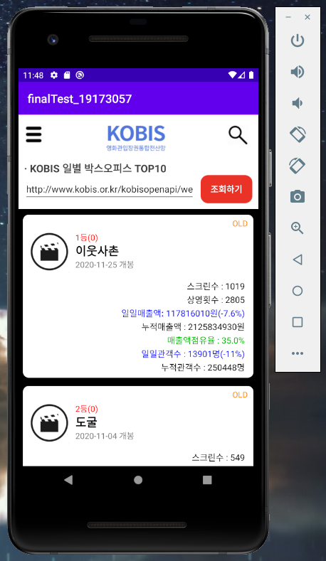
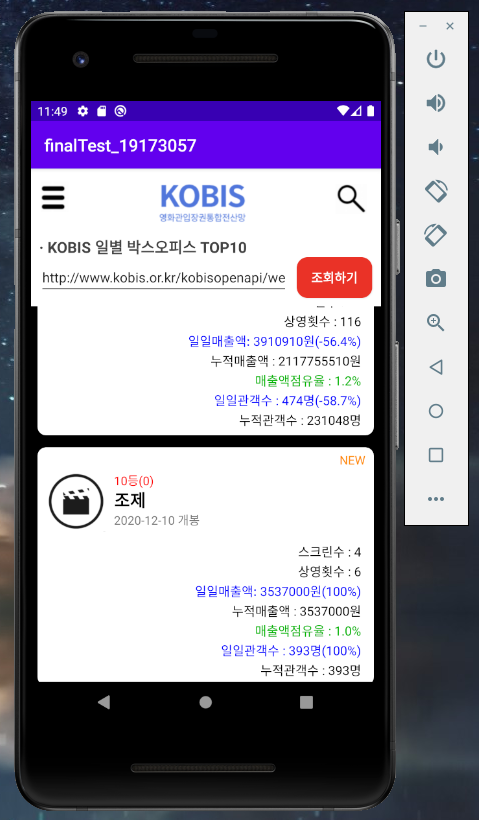

## IT비즈니스과 B반 19173057 김난희
### 캡스톤디자인 2-2 기말과제 개발내용

<B>1. 프로젝트 소개</B>
- 프로젝트명 : lastTest_19173057
- 프로젝트 내용 : 13~14주차 실습 응용, KOBIS(영화관입장권통합전산망) OPEN API를 이용한 일별 박스오피스 시각화 앱 개발
- 구현하고자 하는 것 : 프로젝트 개발 기준 가장 최근 날짜(2020.12.02)의 일별 박스오피스 내용 구현하기

<B>2. KOBIS OPEN API 불러오기</B>

1) KOBIS 홈페이지에서 불러오고자 하는 일별 박스오피스(2020.12.02) 내용 확인

</img>

2) 영화관입장권통합전산망 오픈API 사이트 접속(https://www.kobis.or.kr/kobisopenapi/homepg/main/main.do)

</img>

3) 회원가입 및 로그인 후, 키 발급/관리에서 키 발급받기(*하루 트래픽 3000회 제한이 있어 개인이 키를 발급하여 사용하는 것이 용이하다.)

</img>

4) 발급받은 키를 이용하여 KOBIS 2020.12.02 일별 박스오피스 OPEN API를 조회한다. 

</img>

아래 링크 key에 본인이 발급한 키 입력, targetDt에 조회하고자 하는 날짜를 입력하여 검색하면 된다.

http://www.kobis.or.kr/kobisopenapi/webservice/rest/boxoffice/searchDailyBoxOfficeList.json?key=70968da465624799e4787516ce2a92e8&targetDt=20201202

  
5) 위 OPEN API 링크와, 영화관입장권통합전산망 오픈 API 사이트에 명시되어 있는 API 응답 구조를 참고하여 앱 개발.

</img>

<B>2. 로그인 페이지 안드로이드 스튜디오 코드 개발 내용</B>

<B>3. 일별 박스오피스 조회 페이지 안드로이드 스튜디오 코드 개발 내용</B>

<개발에 사용한 API 구성들>
- movieNm 영화 이름
- audiCnt 일일관객수 
- audiChange 전일 대비 관객수 증감 비율
- openDt 영화개봉일
- rankOldAndNew 랭킹 신규진입여부
- rank 순위
- rankInten 전일 대비 순위 증감분
- audiAcc 누적관객수
- scrnCnt 스크린수
- showCnt 상영횟수
- salesShare 매출액점유율
- salesAmt 일일매출액
- salesChange 전일 대비 매출액 증감 비율
- salesAcc 누적매출액

</img>

자세한 내용은 안드로이드 스튜디오 깃허브 연동 파일들을 참고해주세요. 

<B>4. UI 개발 내용</B>

1) 메인페이지 UI

</img> </img>

- 가운데 로고 배치, 로고 양 옆에 메뉴 이미지와 돋보기 이미지를 넣어 실제 KOBIS 앱 같은 느낌을 주려고 함.
- 로고 밑에 텍스트뷰 : KOBIS 일별 박스오피스 TOP10를 넣어 무엇을 조회하는지 알려줌.
- 본인이 영화하면 떠오르는 색깔과 이미지가 "검정"과 "빨강"이여서 배경색을 검정색으로, 버튼색을 빨강색으로 하여 포인트를 줌.
- drawbel폴더에 button.xml 파일을 생성하여 버튼 라운드 효과
- 조회 링크와 조회하기 버튼을 나란히 배치.

2) 카드뷰 구성

</img> </img>

- 구성은 위와 같음.
- 주 내용은 텍스트뷰 오른쪽 하단에 정렬
- 슬레이트 모양의 아이콘 이미지 추가
- 중요하다고 생각되는 내용은 색깔을 넣어 구분함.

<B>2. 실제 에뮬레이터 실행 모습</B>

최종적으로 에뮬레이터를 실행시키면 아래와 같다.

1) 로그인 페이지(실행시켰을 때 가장 처음 보이는 화면)

</img>

2) 이메일 및 패스워드 입력

</img>

3) 카카오톡ID로 로그인하기 버튼을 누르면 토스트 메시지가 나타남.

</img>

4) 로그인버튼 클릭 후 일별 박스오피스 조회 메인페이지가 나타남.

</img>

5) 조회하기 버튼 클릭 후 2020.12.02 일별 박스오피스 TOP10이 화면에 나타남.

</img>

</img>

